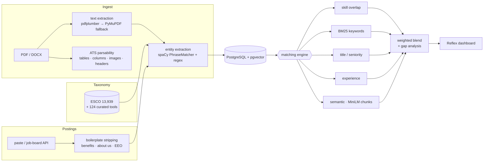

# Resume ↔ Job Matching Engine

An ATS-style resume screener you can see inside. It scores a resume
against a job posting the way a real Applicant Tracking System would —
hard skill overlap first, keywords second, semantics last — and shows
every number with the weight that produced it, rather than a single
unexplained percentage.

Calibrated against 40 real job postings labelled by an actual candidate.
No posting they called a good fit is rejected; none they ruled out
passes.

```
Data Analyst — Iress                50.2   Likely pass
Data Scientist — Quantium           43.1   Likely pass
Quant Research Intern — Tower       42.8   Likely pass
Associate Data Scientist — Culture Amp  36.6   Borderline
Lead Talent Acquisition — Quantium  28.4   Likely reject
Nurse Practitioner — Eucalyptus     13.4   Likely reject
```

> **Screenshots:** added once the app is deployed — match breakdown,
> leaderboard, resume analysis, gap analysis.

## What it does

1. **Parses** a PDF or DOCX resume, and separately checks whether its
   *formatting* would survive a real ATS: tables, multi-column layouts,
   images, headers and footers. A resume can match perfectly on content
   and still be shredded by the parser, so this score is kept out of the
   match score entirely.
2. **Extracts** skills against a 14,063-term taxonomy (ESCO plus 124
   curated modern tools ESCO has never heard of), job titles, education
   and years of experience.
3. **Scores** the pair across five components, each with a published
   weight, and drops any component that has no signal rather than
   scoring it zero.
4. **Explains** the result: which required skills matched, which are
   missing, how often the posting repeated each one, which keywords drove
   the score, and what to add to the resume.

## The scoring model

| Component | Weight | What it measures | Measured AUC¹ |
|---|---|---|---|
| Skill overlap | 40% | Taxonomy skills the posting requires that the resume has | 0.88 |
| Semantic similarity | 20% | Section-level embedding similarity (MiniLM over pgvector) | 0.74 |
| Keyword (BM25) | 15% | Distinctive posting terms, IDF-weighted against ~2.4k resumes | 0.61 |
| Title & seniority | 15% | Role family and level distance | 1.00² |
| Experience | 10% | Stated years against the advertised minimum | 0.50³ |

¹ Ability to separate "good fit" from "no chance" on the labelled set,
alone. 0.5 means no signal.
² Circular — the labels were drafted using "senior role → no", which is
what this component measures. Not evidence the component works; see
[`docs/CALIBRATION.md`](docs/CALIBRATION.md).
³ No signal on this set: only 4 of 40 postings state a minimum, so the
component is dropped from the blend almost everywhere.

Components that produce no signal are **dropped and the remaining weights
renormalised**, so a vaguely written posting cannot silently zero part of
a resume's score.

## Architecture



### It rejects things too

The same resume against a Nurse Practitioner posting scores 13.45, **Weak
fit**: zero required skills matched, skill overlap and title both 0. The
negative controls matter as much as the positives — a matcher that only
ever says yes has not been tested.

### Ranked against every stored posting

One resume against all 41 stored postings, best first: graduate and data
roles at the top, senior and unrelated roles at the bottom. Rows stream in
as each posting finishes scoring.

### Postings are read, not just pasted

A pasted posting is parsed on the way in: a graduate data analyst role
yields 28 required skills, with the "Requirements" and "Nice to have"
headings deciding which are mandatory. The original text is kept beside
them so the extraction can be checked against it.

### What the parser actually read

ATS parsability is scored separately from content and never folded into
the match score. One resume scores a clean 100/100, while six other
versions of the same CV score 75 because their layout uses a table.

### Where the gaps are

Missing skills are ordered by requirement, then by how often the posting
repeats the term, alongside related skills the candidate already has —
drawn from skills that share ESCO occupations with the missing one.

## What makes it not a keyword cloud

- **BM25 runs against a real corpus.** IDF is a property of a corpus, so
  document frequencies come from ~2,400 resumes. A two-document
  comparison would give every term the same IDF and produce an expensive
  word counter.
- **Job-posting boilerplate is stripped before scoring.** Benefits,
  "about us" and EEO sections are half a posting and describe the
  employer, not the job. Left in, the BM25 query filled with words like
  "carers" and "parental" while `sql` and `forecasting` fell out of it.
- **Thin postings can't score highly by accident.** A posting yielding 4
  extractable skills where the resume matches 2 used to score 50% — above
  a real data analyst posting yielding 18 where 8 matched. The overlap
  denominator now has a floor.
- **Semantic similarity is chunked and measured.** Whole-document
  embeddings average out to "this is a CV"; pooling per section keeps the
  signal. The rescale bounds were measured across 268 real matches, not
  guessed.
- **Missing signals are dropped, not zeroed.** A student resume with no
  job-title line scores neutral on title, not 0 — the earlier behaviour
  zeroed 15% of every score for exactly the people most likely to use the
  tool.

## Results

Calibrated on 24 Sep 2026 against 40 real postings (13 pasted from
LinkedIn/Seek, 27 pulled from Greenhouse/Lever/Ashby APIs), spanning
graduate through senior roles in quant, data, AI and finance, plus
deliberate mismatches in nursing, sales and marketing. Six resumes were
scored against all of them, 240 pairs in total.

| Candidate's label | likely_pass | borderline | likely_reject |
|---|---|---|---|
| good (7) | 5 | 2 | 0 |
| maybe (10) | 1 | 4 | 5 |
| no (23) | 0 | 9 | 14 |

Rank correlation with the candidate's judgement: **0.59**. Separation of
"good" from "no": **AUC 0.96**. Leave-one-out band accuracy: **70%**.

**The honest weakness:** domain discrimination is weak (structural AUC
**0.68**). The engine orders plausible matches well, but cannot reliably
tell a data role from a sales role — a chef's resume outscores the data
resume on 1 of 8 unrelated postings, and the data resume wins only 13 of
21 relevant ones against deliberate mismatches. The likely cause is
ESCO's generic tail ("communication", "statistics", "project
management"), which appears in nearly every posting and on nearly every
resume. Full numbers, including what was deliberately *not* tuned and
why, are in [`docs/CALIBRATION.md`](docs/CALIBRATION.md).

## Getting it running

```bash
python -m venv venv && source venv/bin/activate
pip install -r requirements.txt

cp .env.example .env      # DATABASE_URL (Postgres + pgvector), ADZUNA_APP_ID/KEY

psql $DATABASE_URL -f db/init_pgvector.sql
psql $DATABASE_URL -f db/schema.sql
psql $DATABASE_URL -f db/migrations/002_matching_engine.sql

python -m src.nlp.load_taxonomy          # ESCO skills → skills_taxonomy
python -m scripts.load_tech_skills       # + 124 curated modern tools

cd app && reflex run                     # http://localhost:3000
```

**Postings don't ship with the repo** — the text belongs to the employers
who wrote it, so `data/jds/` is gitignored and the database starts empty.
In the app, one button pulls five current graduate postings from company
job boards and another loads three fictional samples; postings can also
be pasted in. From the command line:

```bash
python -m scripts.fetch_board_jds        # ~235 live Australian postings,
                                         # Greenhouse/Lever/Ashby, no API key
python -m scripts.build_eval_set         # sample across level and domain, ingest
```

`data/eval/labels.csv` records the titles, companies and fit labels behind
the calibration, so the published numbers can be traced without
redistributing anyone's job ads.

The BM25 corpus statistics ship with the repo
(`data/processed/bm25_corpus_stats.json`): they are aggregate document
frequencies with no corpus text, and rebuilding them needs the Kaggle
resume set, which is not redistributable.

CLI, if you prefer it to the dashboard:

```bash
python -m src.ingestion.pipeline resume.pdf          # parse + store
python -m scripts.add_jd posting.txt                 # store a posting
python -m src.matching.match_pipeline --resume-id 1 --jd-id 1
```

**Note:** changes under `src/` need a Reflex restart — its hot reload
only watches `app/`.

## Documentation

| Document | Contents |
|---|---|
| [`docs/CALIBRATION.md`](docs/CALIBRATION.md) | Weight and threshold calibration, what was measured, what was left alone and why |
| [`docs/validation-results.md`](docs/validation-results.md) | First run against real postings: five bugs no unit test caught |
| [`docs/MATCHING-ENGINE.md`](docs/MATCHING-ENGINE.md) | Each scoring component, and the reasoning behind it |
| [`docs/PARSING-AND-EXTRACTION.md`](docs/PARSING-AND-EXTRACTION.md) | Parsing, ATS parsability, NER, taxonomy matching |
| [`docs/UI.md`](docs/UI.md) | Dashboard structure and the Reflex 0.9 gotchas |
| [`docs/REPO-AND-DATA-SETUP.md`](docs/REPO-AND-DATA-SETUP.md) | Where each dataset comes from |
| [`docs/DEPLOYMENT.md`](docs/DEPLOYMENT.md) | Deployment assessment, and the auth blocker that comes first |
| [`docs/ROADMAP.md`](docs/ROADMAP.md) | Phases, done and planned |

## Stack

PostgreSQL + pgvector · spaCy · sentence-transformers (MiniLM) · BM25
(implemented directly) · Reflex · Adzuna and Greenhouse/Lever/Ashby APIs

## Limitations

- Calibrated on one resume, 40 postings, one labeller. Scores compare
  postings against each other, not against an external standard.
- Domain discrimination is weak (AUC 0.68) — see above.
- ATS parsability is a coarse four-check subtraction; in practice the
  table check does most of the work.
- Extraction against a general-purpose taxonomy still produces occasional
  nonsense ("job opportunities" → *job market offers*).
- Session-scoped, not authenticated: each browser session sees only what
  it added, and that data is deleted 24 hours later. Good enough for a
  public demo; it is not an account system, and anyone who recovers a
  session token could read that session's data
  ([`docs/DEPLOYMENT.md`](docs/DEPLOYMENT.md)).
- 114 tests, all ordering- and behaviour-based rather than asserting
  magic score constants, so recalibration doesn't break them.
